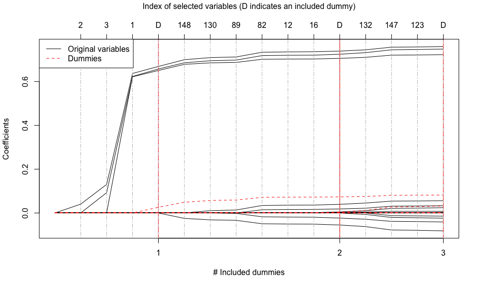
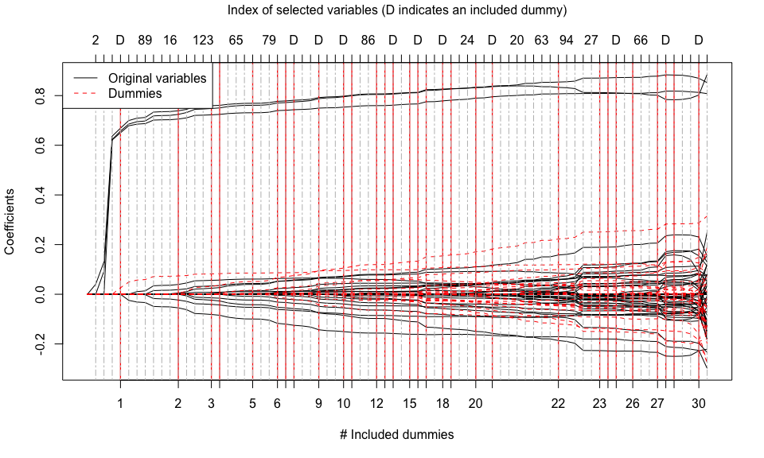

---
output:
  html_document:
    variant: markdown_github
    keep_md: yes
  md_document:
    variant: markdown_github
  pdf_document: default
---

<!-- README.md is generated from README.Rmd. Please edit that file -->


# tlars
**Title**: The T-LARS Algorithm: Early-Terminated Forward Variable Selection

**Description**: It computes the solution path of the Terminating-LARS (T-LARS) algorithm. The T-LARS algorithm appends dummy predictors to the original predictor matrix and terminates the forward-selection process after a pre-defined number of dummy variables has been selected.

**Note**: The T-LARS algorithm is a major building block of the T-Rex selector ([Paper](https://arxiv.org/abs/2110.06048) and [R package](https://github.com/jasinmachkour/trex)). The T-Rex selector performs terminated-random experiments (T-Rex) using the T-LARS algorithm and fuses the selected active sets of all random experiments to obtain a final set of selected variables. The T-Rex selector provably controls the false discovery rate (FDR), i.e., the expected fraction of selected false positives among all selected variables, at the user-defined target level while maximizing the number of selected variables.

In the following, we show how to use the package and give you an idea of why terminating the solution path early is a reasonable approach in high-dimensional and sparse variable selection: In many applications, most active variables enter the solution path early!

## Installation
You can install the 'tlars' package from [GitHub](https://github.com/jasinmachkour/tlars) with 

``` r
install.packages("devtools")
devtools::install_github("jasinmachkour/tlars")
```

You can open the help pages with

```r
library(tlars)
help(package = "tlars")
?tlars
?tlars_model
?tlars_cpp
?plot.Rcpp_tlars_cpp
?print.Rcpp_tlars_cpp
?Gauss_data
```

To cite the package 'tlars' in publications use:

```r
citation("tlars")
```


## Quick Start
In the following, we illustrate the basic usage of the 'tlars' package to perform variable selection in sparse and high-dimensional regression settings using the T-LARS algorithm.

1. **First**, we generate a high-dimensional Gaussian data set with sparse support:


```r
library(tlars)

# Setup
n <- 75 # Number of observations
p <- 150 # Number of variables
num_act <- 3 # Number of true active variables
beta <- c(rep(1, times = num_act), rep(0, times = p - num_act)) # Coefficient vector
true_actives <- which(beta > 0) # Indices of true active variables
num_dummies <- p # Number of dummy predictors (or dummies)

# Generate Gaussian data
set.seed(123)
X <- matrix(stats::rnorm(n * p), nrow = n, ncol = p)
y <- X %*% beta + stats::rnorm(n)
```

2. **Second**, we generate a dummy matrix containing n rows and num_dummies dummy predictors that are sampled from the standard normal distribution and append it to the original predictor matrix:


```r
set.seed(1234)
dummies <- matrix(stats::rnorm(n * num_dummies), nrow = n, ncol = num_dummies)
XD <- cbind(X, dummies)
```

3. **Third**, we generate an object of the C++ class 'tlars_cpp' and supply the information that the last num_dummies predictors in XD are dummy predictors:


```r
mod_tlars <- tlars_model(X = XD, y = y, num_dummies = num_dummies)
#> Created an object of class tlars_cpp... 
#> 		 The first p = 150 predictors in 'XD' are the original predictors and 
#> 		 the last num_dummies = 150 predictors are dummies
```

4. **Finally**, we perform three T-LARS steps on 'mod_tlars', i.e., the T-LARS algorithm is run until **T_stop = 3** dummies have entered the solution path and stops there. For comparison, we also compute the whole solution path by setting early_stop = FALSE:

4.1. Perform three T-LARS steps on object 'mod_tlars':


```r
tlars(model = mod_tlars, T_stop = 3, early_stop = TRUE) # Perform three T-LARS steps on object "mod_tlars"
#> Executing T-LARS step by reference...
#> 		 Finished T-LARS step(s)... 
#> 			 - The results are stored in the C++ object 'mod_tlars'.
#> 			 - New value of T_stop: 3.
#> 			 - Time elapsed: 0.001 sec.
print(mod_tlars) # Print information about the results of the performed T-LARS steps
#> 'mod_tlars' is a C++ object of class 'tlars_cpp' ... 
#> 	 - Number of dummies: 150.
#> 	 - Number of included dummies: 3.
#> 	 - Selected variables: 2, 3, 1, 148, 130, 89, 82, 12, 16, 132, 147, 123.
plot(mod_tlars) # Plot the terminated solution path
```



4.2. Compute the whole solution path:


```r
tlars(model = mod_tlars, early_stop = FALSE) # Compute the whole solution path
#> 'T_stop' is ignored. Computing the entire solution path...
#> Executing T-LARS step by reference...
#> 		 Finished T-LARS step(s). No early stopping! 
#> 			 - The results are stored in the C++ object 'mod_tlars'.
#> 			 - Time elapsed: 0.01 sec.
print(mod_tlars) # Print information about the results
#> 'mod_tlars' is a C++ object of class 'tlars_cpp' ... 
#> 	 - Number of dummies: 150.
#> 	 - Number of included dummies: 30.
#> 	 - Selected variables: 2, 3, 1, 148, 130, 89, 82, 12, 16, 132, 147, 123, 122, 65, 47, 107, 79, 54, 39, 62, 46, 116, 86, 102, 81, 129, 24, 41, 26, 83, 20, 28, 72, 63, 60, 94, 135, 6, 27, 7, 66, 98, 112, 111, 74.
plot(mod_tlars) # Plot the whole solution path
```



## Outlook
The T-LARS algorithm is a major building block of the T-Rex selector ([Paper](https://arxiv.org/abs/2110.06048) and [R package](https://github.com/jasinmachkour/trex)). The T-Rex selector performs terminated-random experiments (T-Rex) using the T-LARS algorithm and fuses the selected active sets of all random experiments to obtain a final set of selected variables. The T-Rex selector provably controls the FDR at the user-defined target level while maximizing the number of selected variables. If you are working in genomics, financial engineering, or any other field that requires a fast and FDR-controlling variable/feature selection method for large-scale high-dimensional settings, then this is for you. Check it out!

## Documentation
For more information and some examples, please check the
[GitHub-vignette](https://htmlpreview.github.io/?https://github.com/jasinmachkour/tlars/blob/main/vignettes/tlars_variable_selection.html).


## Links
tlars package: [GitHub-tlars](https://github.com/jasinmachkour/tlars).

README file: [GitHub-readme](https://htmlpreview.github.io/?https://github.com/jasinmachkour/tlars/blob/main/README.html).

Vignette: [GitHub-vignette](https://htmlpreview.github.io/?https://github.com/jasinmachkour/tlars/blob/main/vignettes/tlars_variable_selection.html).

trex package: [GitHub-trex](https://github.com/jasinmachkour/trex).

T-Rex paper: https://arxiv.org/abs/2110.06048


